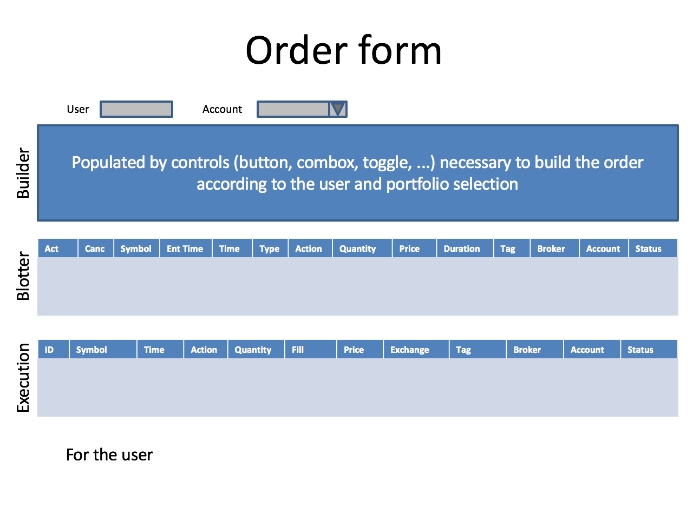
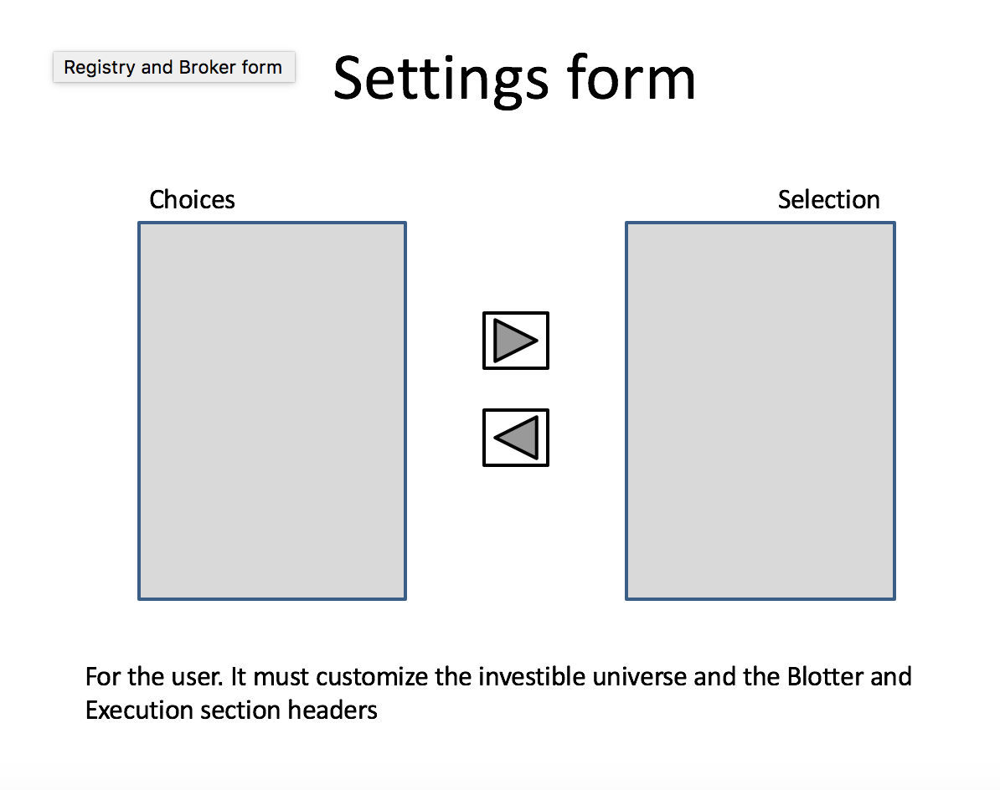
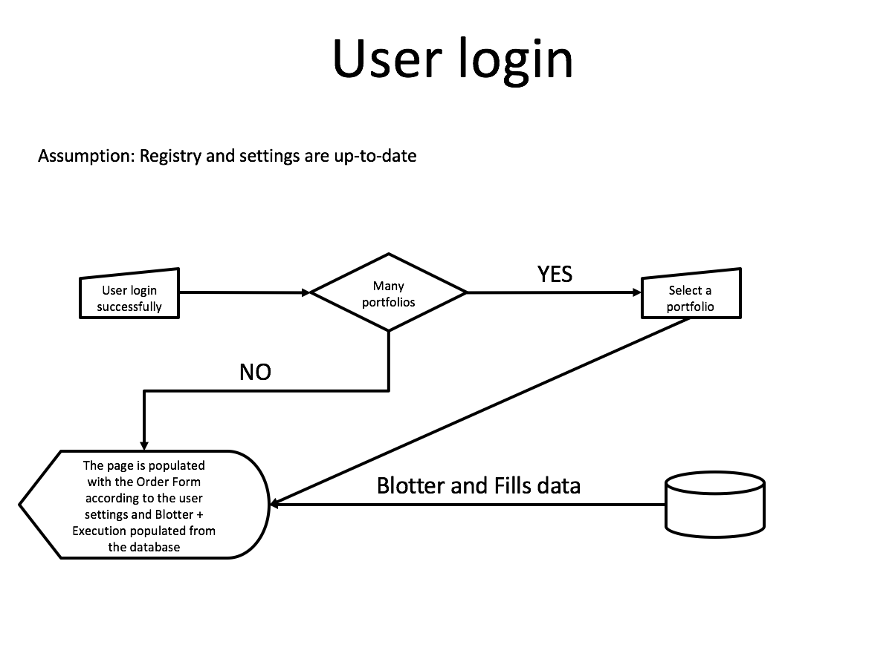
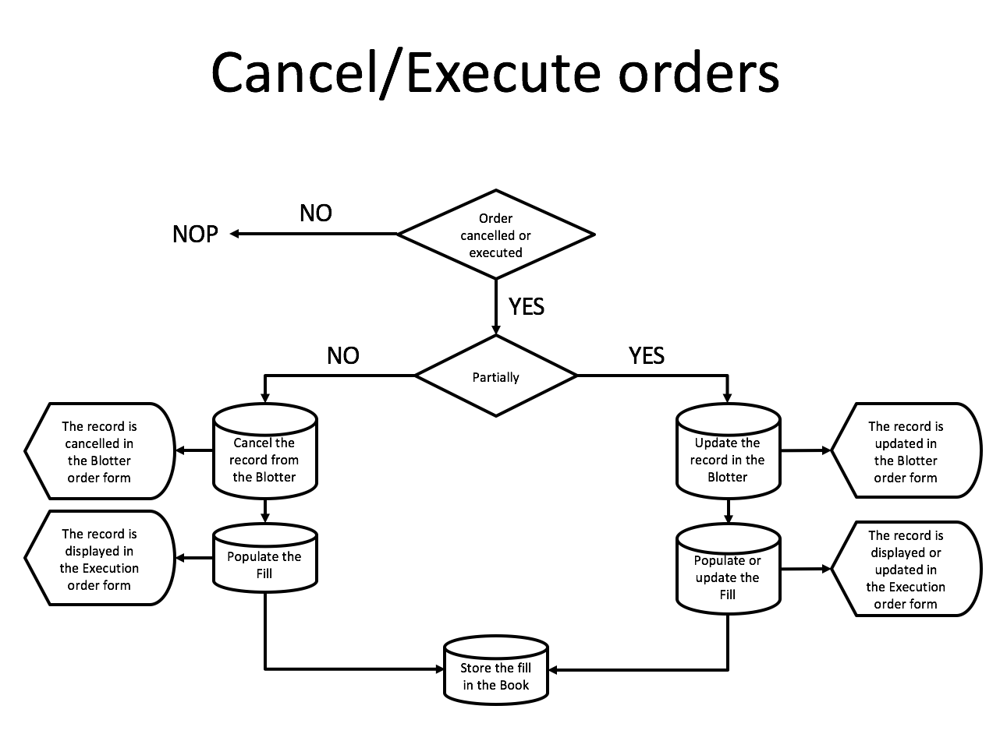

# Welome to the OMP project page

## Description
The project should produce a web application to place electronic financial orders 
to whatever broker using the standard FIX protocol.
Main components are:

* A database to store orders proposal and filled order (the book). Moreover the 
database must maintain all details for each traded instruments (the registry), user 
settings and broker details

* A GUI to build an order (or a set of orders) that must be sent to the broker via 
the FIX protocol

* A GUI that allows each used to determine the desired settings

* GUIs to register a new traded instrument with all its detailsand  brokers info

## Structure

### Order form
Here's how the order form should look like:

### Settings form
Here is the structure of the settings form:

## Flow

